# New Commerce Experience Batch Migration Tool (BAM) 

## Table of Contents 

1. [Introduction](#Introduction)
2. [Experience Summary](#Experience-Summary)
3. [Software Pre-requisites](#Software-Pre-Requisites)
5. [Step-by-step flow for migrating a batch](#Step-by-step-flow-of-migrating-a-batch)
4. [Begin running the Tool and Authenticate Your Account](#Begin-running-the-Tool-and-Authenticate-your-Account)
6. [Load .NET console app ](#Load-.NET-console-app)
7. [Export customers](#Export-customers)
8. [Export subscriptions for customers with migration eligibility](#Export-subscriptions-for-customers-with-migration-eligibility)
9. [Determine which subscriptions will be migrated and how](#Determine-which-subscriptions-will-be-migrated-and-how)
10. [Submitting a batch of subscriptions for migration](#Submitting-a-batch-of-subscriptions-for-migration)
11. [Checking migration status](#Checking-migration-status)
12. [Exporting a list of New Commerce Experience subscriptions](#Exporting-a-list-of-New-Commerce-Experience-subscriptions)
13. [Additional notes and resources](#Additional-notes-and-resources)

## Introduction 

To facilitate partner needs of efficiently migrating large quantities of subscriptions before upcoming New Commerce Experience milestones, Microsoft has enabled a Batch Migration (BAM) tool. The BAM tool allows partners to migrate subscriptions into NCE with the following approach:

* Streamlined open source .NET SDK sample app experience  

* Leverages Excel to manage migration edits  

* Simple tool supporting high quality, repeatable, and customizable migration scenarios in batches 

* No code required 

## Experience Summary 

Below is a high-level workflow of the console app experience and batch migration flow. 

 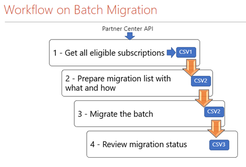
 

## Software Pre-Requisites 

In order to build and run the BAM tool, .NET 6.0 SDK software is required. 

## Step-by-step flow of migrating a batch 

### Begin Running the Tool and Authenticate your Account 

Steps for tool setup: 

* Open command prompt and navigate to the folder where NCEBulkMigrationTool.sln is located.
* Run command: 
```
dotnet build -c Release
```
* Once the application is done building navigate to the folder (NCEBulkMigrationTool\bin\Release\net6.0)
* Find the file NCEBulkMigrationTool.exe this is the executable which runs the tool.
* You can either run the tool where you found the original .exe file or you can copy all of the contents of the folder (NCEBulkMigrationTool\bin\Release\net6.0) into a new folder to begin executing the tool.

Steps to run the tool:
* Using Command Prompt navigate to the folder where is CEBulkMigrationTool.exe located (Use above steps to locate file after building) 
* In command prompt run the following command: 
```
.\NCEBulkMigrationTool.exe <AppId> <Upn> 
```

* If a previous version of the tool was installed, enter the following command in the Command Prompt to uninstall the older version: 
```
dotnet tool uninstall ncebulkmigrationtool -g 
```
* NOTE: If multiple users are running at the same time from the same folder then files can be overwritten or access can be denied. It is better to copy the tool to multiple folders and each user can operate on a separate instance of the tool 
 

### Load .NET console app 

Follow the above section to get the tool running:  
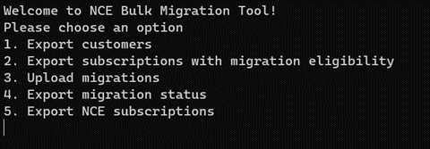

Once the tool is running and the account is authenticated a Partner can:
 1. Export customers
 2. Export subscriptions with migration eligibility 
 3. Upload subscriptions to be migrated
 4. export the migration status of batches that have already been uploaded for migration. 

## Export customers 

To export a list of customers, enter command “1”. This will produce a CSV similar to the below example:  

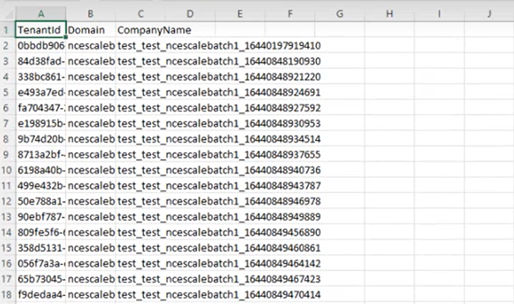
 
The exported list of customers will be available in the “output” file of the tool’s folders.  

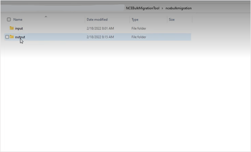

View exported customers in the file “customers.csv”. For each customer under a partner tenant ID, users can view customer tenant ID, customer domain, and customer company name.  


## Export subscriptions for customers with migration eligibility 

In the downloaded “customers.csv” file, the user can remove rows for the customers whose subscriptions they do not want to export in the next file download. The remaining customers on the file represent customers whose subscriptions will be validated for migration eligibility during the next step in the BAM tool’s flow. 

Please save the updated “customers.csv” in the “input” folder in order to successfully execute the next step of receiving subscriptions for the specified customers. The “input” folder contains 2 other nested folders labelled “migrations” and “subscriptions”. Do not place the “customers.csv” file in the nested folders; simply keep it in the “input” folder. 

Run the BAM tool and enter command “2” to export subscriptions with migration eligibility.  

 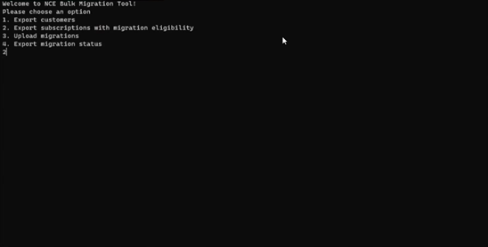

The console app will indicate subscriptions are being validated for eligibility, as seen in the screenshot above.  

 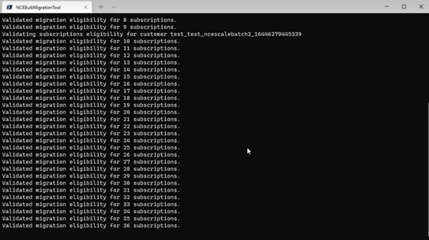

Once export is complete, the list of subscriptions for the specified customers will be available in the output folder as “subscriptions.csv”. 

 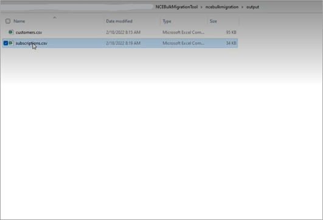

The “subscriptions.csv” file will provide a list of all legacy subscriptions (both active and suspended) under the customers previously specified.  

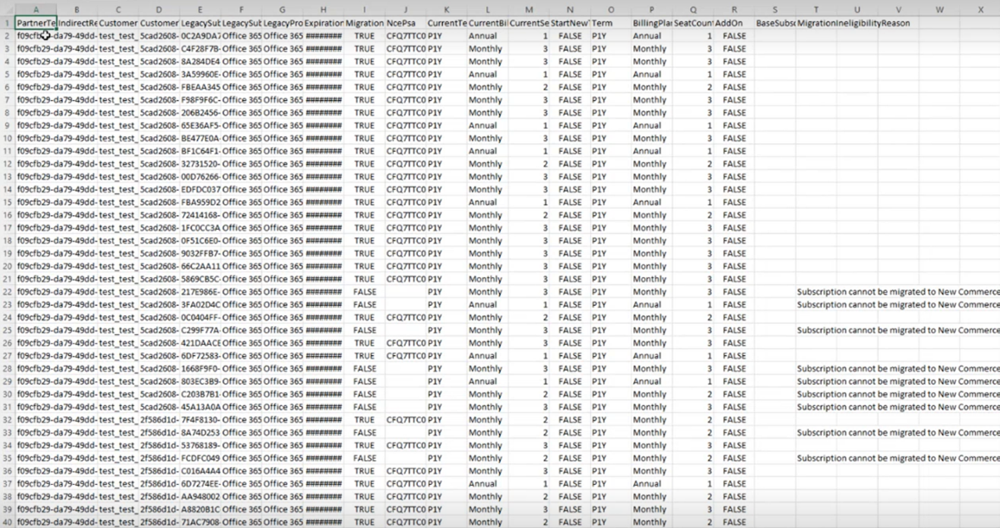

The following fields can be viewed for each subscription: 
* Partner tenant ID 
* Indirect Reseller MPN ID 
* Customer Name 
* Customer Tenant ID 
* Legacy Subscription ID 
* Legacy Subscription Name 
* Legacy Product Name 
* Expiration Date 
* Migration Eligible (True or False) 
* Current Term 
* Current Billing Plan 
* Current Seat Count 
* Start New Term (post migration in NCE) 
* Term (post migration in NCE) 
* Billing Plan (post migration in NCE) 
* Seat Count (post migration in NCE) 
* Add On (True or False) 
* Base Subscription (if an add-on) 
* Migration Ineligibility Reason (if subscription is not eligible for migration) 

## Determine which subscriptions will be migrated and how 

With the fields above, users can filter through the exported list of subscriptions to determine which subscriptions they would like to migrate to NCE in a batch. Supported cases may include filtering to migrate subscriptions of a specific product type or subscriptions under a particular indirect reseller in a batch. 

Once subscriptions have been filtered and selected, please delete subscriptions that are not selected for the batch from the CSV file. This will prevent any unintended migrations. 

**Our recommendation is a limit of 100 subscriptions per batch.** 

The next step is determining how they would like the subscriptions to be migrated (e.g. like-to-like or with updated start new term, billing frequency, term duration or seat count attributes). 

Users may overwrite the following fields in rows for subscriptions they would like to migrate: 
* Start New Term 
* Term 
* Billing Plan 
* Seat Count 

These fields represent the instructions or attributes that the NCE subscription will adhere to post-migration. The default values for these fields are the values held by the Legacy subscription being migrated. If no changes are made to a field, the corresponding NCE subscription will have the same value held by the Legacy subscription it migrated from. For example, if a Legacy subscription being migrated has a Current Seat Count of 2 and no changes are made to the Seat Count field, the NCE subscription will have a seat count of 2 post-migration. 

For a subscription to start a new term in NCE, please change the Start New Term flag from FALSE to TRUE. 

**Please do not change values outside of the Start New Term, Term, Billing Plan, and Seat Count columns.**

## Submitting a batch of subscriptions for migration 

Once a batch has been determined (subscriptions for migration have been filtered through and have updated NCE values if desired), save your updated “subscriptions.csv” file in the “subscriptions” folder nested in the “input” folder. Each file saved in the ”subscriptions” folder represents a batch to migrate. 

Once all batch files have been added to the folder run the console app and select option 3, upload migrations, for the app to begin reading in batch files in the “subscriptions” folder and executing migration requests. 

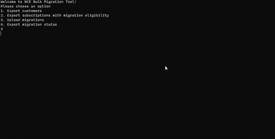

The console will indicate that the migration requests are being processed:  

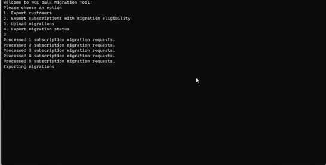

Once a file from the “subscriptions” folder has been processed for migration, the tool will move that file into the nested “processed” folder, indicating that migration requests for that batch have been executed. Partners do not need to manually move files into the “processed” folder themselves; files in the “processed” folder will not be read by the app to execute migration on (as they have already been handled). 

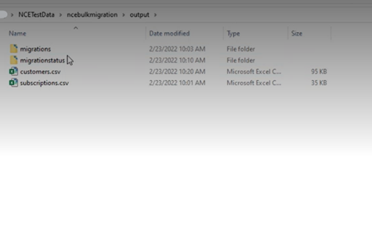

A file for each batch containing the migration IDs will be exported (available in the “migrations” folder nested in the “output” folder). The exported files will be labelled “[batchId].csv”. 

 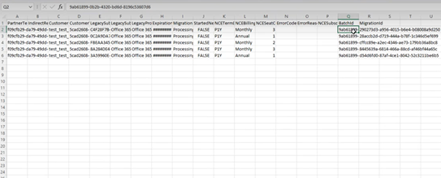

This file will possess the same fields as the input “subscriptions.csv” file with 2 additional columns labeled Batch ID and Migration ID. The Batch ID will be the same for all subscriptions in the file, indicating these subscriptions belong to the same batch or set of migration requests that were processed together. The Batch ID is also reflected in the name of this csv file.  

## Checking migration status 

The Migration ID is unique to each subscription being migrated. Migration ID can be used to track the migration status. The screenshot above indicates that for all subscriptions, the migration status is still processing (column I).  

Once a migration has finished being executed, the status of the migration will be deemed Completed if migration was successful. The NCE Subscription Id will also be populated upon successful migration. If migration was unsuccessful, migration status will be denoted as Failed and the user will be able to view the error reason.  

To be able to retrieve a refreshed status file for a batch, the exported “[batchId].csv” file (exported to the “migrations” folder nested in “output”) must be copied or saved into the “migrations” folder nested in the “input” folder. This will allow the tool to read in which batches status has been requested for and prepare reports to export. 

Then, a partner must run the console app and select to check migration status. Status files will not be automatically updated. To retrieve updated statuses, a new request must be made each time (see below). 

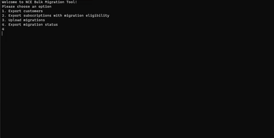

To retrieve updated migration statuses, run the console app and enter command “4”. 

 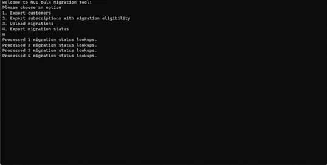

The console app will indicate migration status is being looked up and that a file has been exported to the "migrationstatus” folder. The names of the exported migration status files represent the batch ID of subscriptions contained in the CSVs. 

 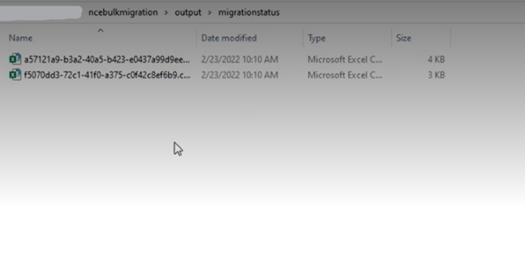

Select the “[batchID].csv” file in the "migrationstatus” folder. 

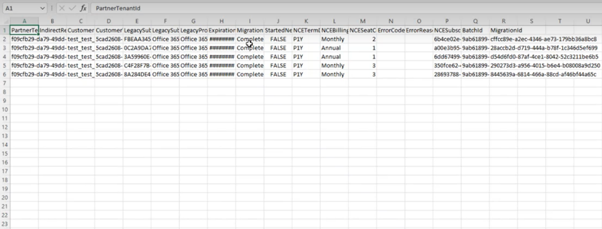

This file will provide updated statuses for migration requests that have been processed. If more than one batch is represented in the file, use the Batch Id column to filter to access statuses of requests in a particular batch. 

## Exporting a list of New Commerce Experience subscriptions 

To export NCE subscriptions, enter command 5. The exported list will show up in your “output” folder and will include the fields displayed in the example file below. 


 
 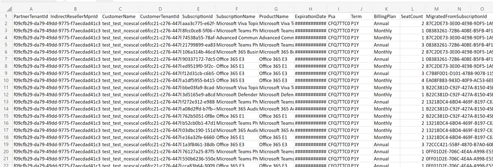

## Additional notes and resources 

Please migrate only one batch of subscriptions at a time to avoid API throttling and rate limits. 

Documentation for migrating subscriptions and additional guidelines is available here: [Migrate subscriptions to new commerce - Partner Center | Microsoft Docs](https://docs.microsoft.com/en-us/partner-center/migrate-subscriptions-to-new-commerce)